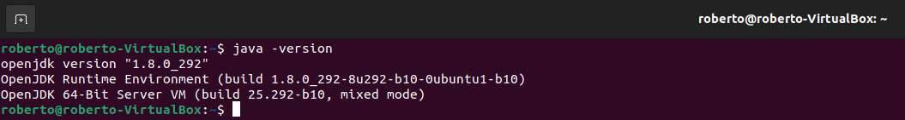
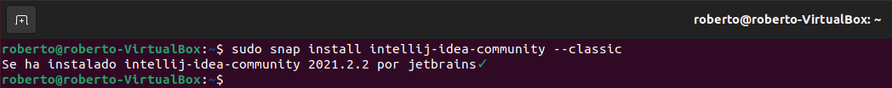

<div align="justify">

# Intellij IDEA
  
 <div align="center">
 
 </div>
  
## Instalar Intellij en Ubuntu.
1.	Primero verificamos que tenemos instalado en el equipo Java para ello utilizamos el siguiente comando: 
  
```
  java -version
```
  
 <div align="center">
 
 </div>
  
2.	Una vez comprobada procedemos a instalar Intellij para ello usamos el siguiente comando:
  
```
  sudo snap install intellij-idea-community --classic
```
 <div align="center">
 
 </div>
  
 ## Instalar Intellij en Ubuntu.
1.	Comprobamos que el icono se encuentra entre las aplicaciones instaladas.
 <div align="center">
 
 </div>
   
2.	Procedemos a abrir el programa y accedemos a su página de inicio.
 <div align="center">
 
 </div>
  
</div>
