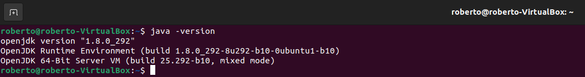

<div align="justify">

# Netbeans 12
  
 <div align="center">
 
 </div>
  
## Instalar Netbeans 12 en Ubuntu.
1.	Primero verificamos que tenemos instalado en el equipo Java para ello utilizamos el siguiente comando: 
  
```
  java -version
```
  
 <div align="center">
 
 </div>
  
2.	Una vez comprobada procedemos a instalar NetBeans 12 para ello usamos el siguiente comando:
  
```
  sudo snap install netbeans --classic
```
 <div align="center">
 
 </div>
  
 ## Instalar Netbeans 12 en Ubuntu.
1.	Comprobamos que el icono se encuentra entre las aplicaciones instaladas.
 <div align="center">
 
 </div>
   
2.	Procedemos a abrir el programa y accedemos a su página de inicio.
 <div align="center">
 
 </div>
  
</div>
