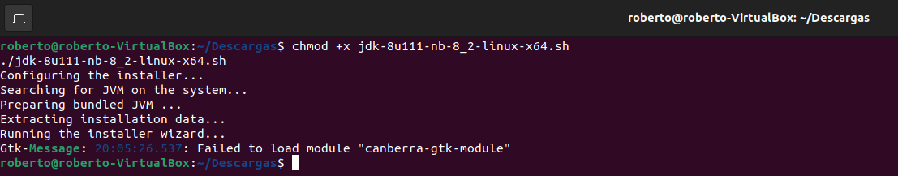
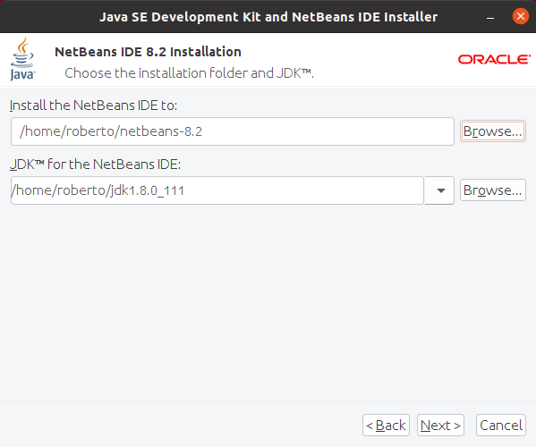
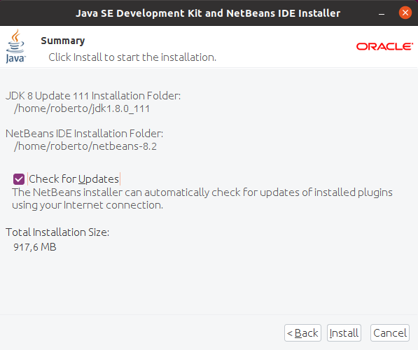
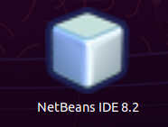
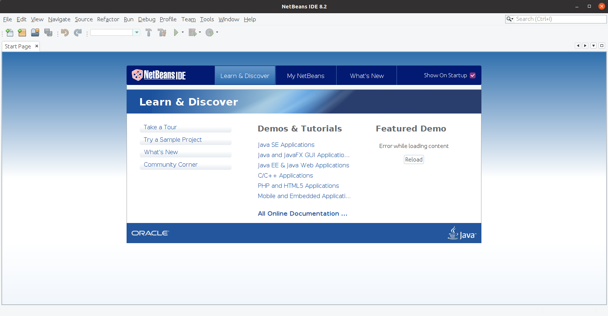

<div align="justify">

# Netbeans 8
  
 <div align="center">
 
 </div>
  
## Instalar Netbeans 8 en Ubuntu.
1.	Primero verificamos que tenemos instalado en el equipo Java para ello utilizamos el siguiente comando: 
  
```
  java -version
```
  
 <div align="center">
 
 </div>
  
2.	Descargamos la versión de 8 de NetBeans para Linux desde su pagina web, una vez terminada la descarga del archivo ejecutamos los siguientes comandos:
  
```
chmod +x jdk-8u111-nb-8_2-linux-x64.sh
./jdk-8u111-nb-8_2-linux-x64.sh
```
 <div align="center">
 
 </div>
3.	Una vez abierto el asistente de instalación seleccionamos la ubicación de donde instalamos NetBeans y el JDK que utilizara.
 <div align="center">
 
 </div>                                    
 4.	Una vez terminada la actualización marcamos la casilla de comprobar las  actualizaciones.     
                                      
 <div align="center">
 
 </div>
  
 ## Instalar Netbeans 8 en Ubuntu.
  
1.	Comprobamos que el icono se encuentra entre las aplicaciones instaladas.
  
 <div align="center">
 
 </div>
   
2.	Procedemos a abrir el programa y accedemos a su página de inicio.
 <div align="center">
 
 </div>
  
</div>
