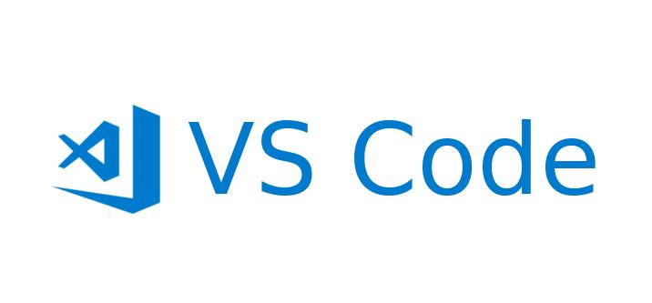
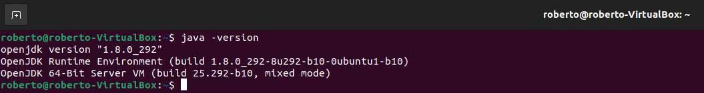
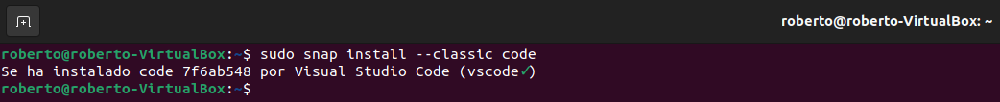
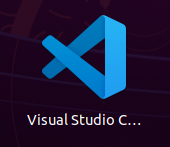
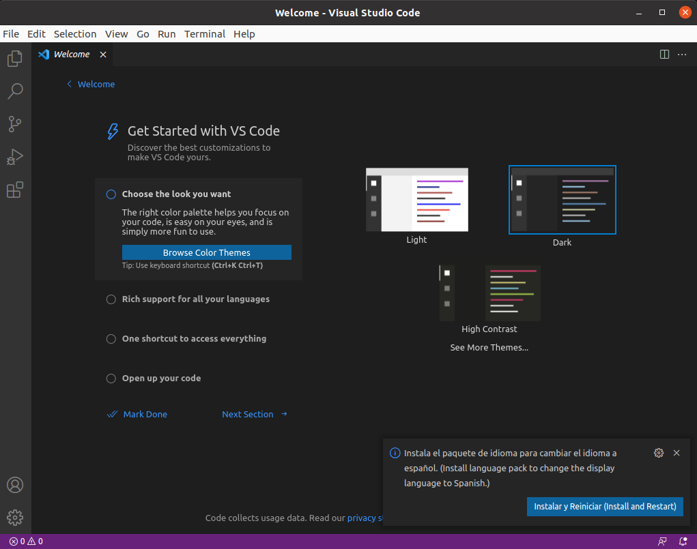
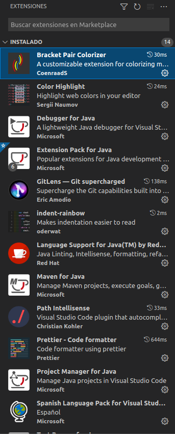
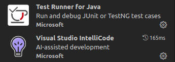

<div align="justify">

# VS Code
  
 <div align="center">
 
 </div>
  
## Instalar VS Code en Ubuntu.
1.	Primero verificamos que tenemos instalado en el equipo Java para ello utilizamos el siguiente comando: 
  
```
  java -version
```
  
 <div align="center">
 
 </div>
  
2.	Una vez comprobada procedemos a instalar VS Code para ello usamos el siguiente comando:
  
```
  sudo snap install --classic code
```
 <div align="center">
 
 </div>
  
 ## Instalar VS Code en Ubuntu.
1.	Comprobamos que el icono se encuentra entre las aplicaciones instaladas.
 <div align="center">
 
 </div>
   
2.	Procedemos a abrir el programa y accedemos a su página de inicio.
 <div align="center">
 
 </div>
3.	A continuación, procederemos a añadir diferentes extensiones del programa:
  
  #### Java Extension Pack

  Una vez instalado Visual Studio Code todavía hemos de realizar una serie de pasos antes de comenzar a trabajar. VS Code es un editor muy versátil, gracias a su diseño modular, podemos añadir soporte para JAVA mediante extensiones. Para facilitar más las cosas, disponemos de un __Java Extension Pack__, que contiene las extensiones más populares usadas por los desarrolladores JAVA:
  - Language Support for Java(TM) de Red Hat
  - Debugger for Java
  - Java Test Runner
  - Maven for Java
  - Java Dependency Viewer

#### Otras extensiones

  Existen extensiones que dejando aparte el tipo de desarrollo que estés realizando, su instalación es casi obligatoria.

##### Visual Studio IntelliCode

  Es una extensión que incorpora inteligencia artificial para ayudarte a codificar. Admite Python, JavaScript / TypeScript y Java.

##### Path Intellisense

  Esta extensión permite escribir fácilmente nombres de rutas de archivos.

##### Bracket Pair Colorizer

  Nos ayuda a ver más fácilmente el bloque de código que se encuentra entre los caracteres (), {}, [] trazando una línea. Permite configurar otros tipos de caracteres.

##### GitLens

  Sobrealimenta las capacidades de Git que ya se encuentran integradas en Visual Studio Code. Ayuda a visualizar el autor del código, navegar y explorar sin problemas los repositorios de Git, obtener información valiosa a través de potentes comandos de comparación y mucho más.

##### Prettier

  Herramienta que formatea el código automáticamente, esto permite despreocuparse de si nuestro código esta bien identado.

##### Color Highlight

  Facilita la visualización de los colores. Rodea el código hexadecimal del color en un rectángulo con el color elegido.

##### Indent Rainbow

  Esta extensión colorea la sangría frente a su texto alternando cuatro colores diferentes en cada paso, ayuda a visualizar el correcto indentado del código.
  
 <div align="center">
 
 </div> 
  
 <div align="center">
 
 </div>
  
</div>
