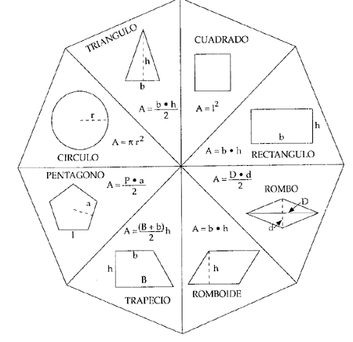

# Tarea cálculo de áreas
## Introducción

El área de una figura geométrica es todo el espacio que queda encerrado entre los límites de esa figura.

  
## Análisis
  

Se plantea realizar un análisis para el desarrollo de una aplicación que permita calcular el área de diferentes figuras geométricas. Estas se muestran en la siguiente imagen.

          
## Requisitos:

Sera necesario tener en cuenta los siguientes requisitos:

- Tipo de figura de la que se quiera obtener el área de las que aparecen en la imagen.
- Párametros necesarios de la figura que sobre la que vaya a realizar el cálculo.
- Formula del área de cada figura.
- Unidad de medida

## Métodos:
Los necesarios para el funcionamiento de la aplicación serian:
-	Pedir figura.
-	Pedir valores de parámetros.
-	Mostar resultado del cálculo y se muestre de manera opcional el nombre y tipo de figura, así como los pasos de seguidos para la obtención del resultado.

