<div align="justify">

# Git
<div align="center">
   
 </div>
  
## Instalar Git en Ubuntu  
  
  1.	Primero verificamos si hay alguna versión de Git instalada en la maquina virtual para ello abrimos una terminal y escribimos el siguiente comando:
  
```
git --version
```
  
<div align="center">
  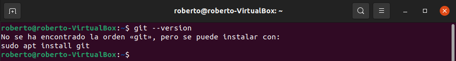
</div>  
  
 2.	Ahora procedemos a actualizar las herramientas de actualización de paquetes para ello utilizamos el comando:
  
```
sudo apt update
``` 
  
<div align="center">
  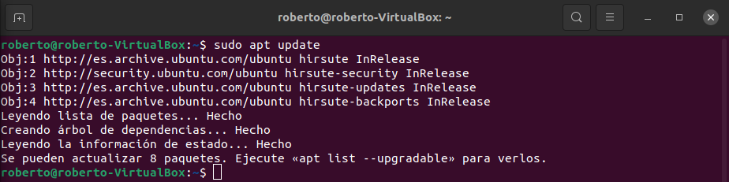
</div> 
  
 3.	Una vez actualizada la herramienta de paquetes. Procedemos a instalar Git para ello introducimos el siguiente comando en la terminal: 
  
```
sudo apt install git
``` 
  
<div align="center">
  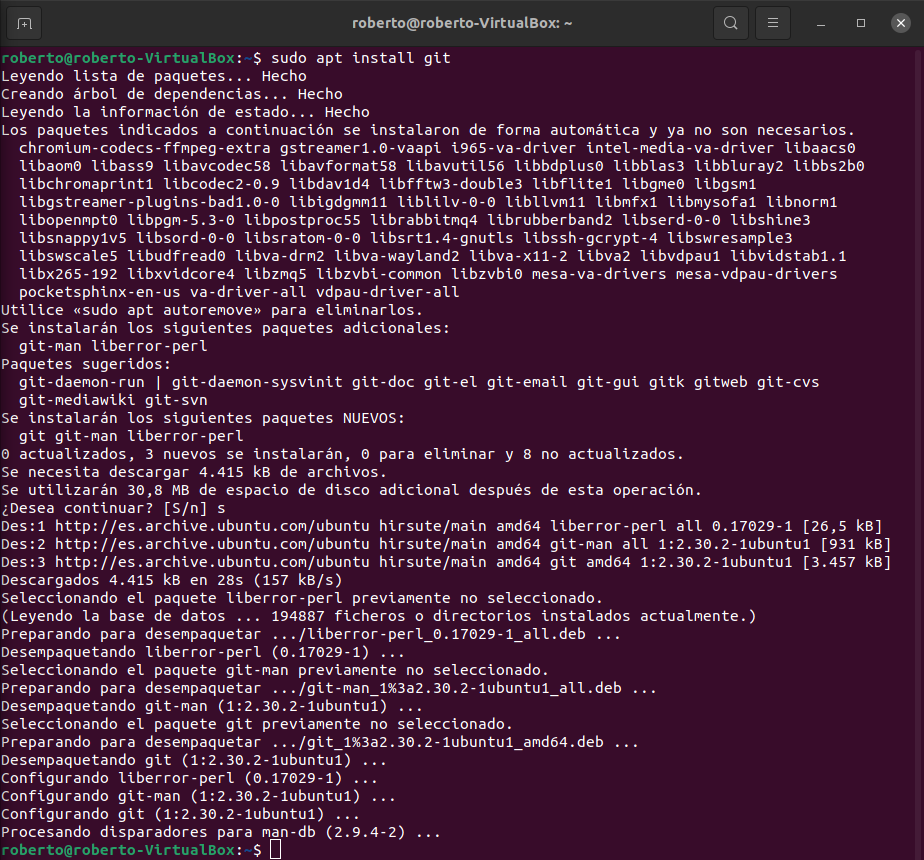
</div> 
  
 4.	Una vez terminado el proceso de instalación, pasamos a confirmar que Git se instaló correctamente, para ello ejecutamos el siguiente comando:  
  
```
git --version
``` 
  
<div align="center">
  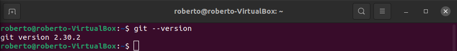
</div> 
  
## Instalación de Git desde la fuente: 
  
 1.	Primero comprobamos la versión de Git que tenemos instalada, para ello empleamos el siguiente comando:
  
```
git --version
```   

<div align="center">
  
</div> 
  
 2.	Antes de comenzar, debemos instalar el software necesario para Git. Todo se encuentra disponible en los repositorios predeterminados, de modo que podemos actualizar nuestro índice local de paquetes y luego instalar los paquetes pertinentes. Para ello utilizamos los siguientes comandos.  
  
```
sudo apt update
sudo apt install libz-dev libssl-dev libcurl4-gnutls-dev libexpat1-dev gettext cmake gcc
```   
  
<div align="center">
  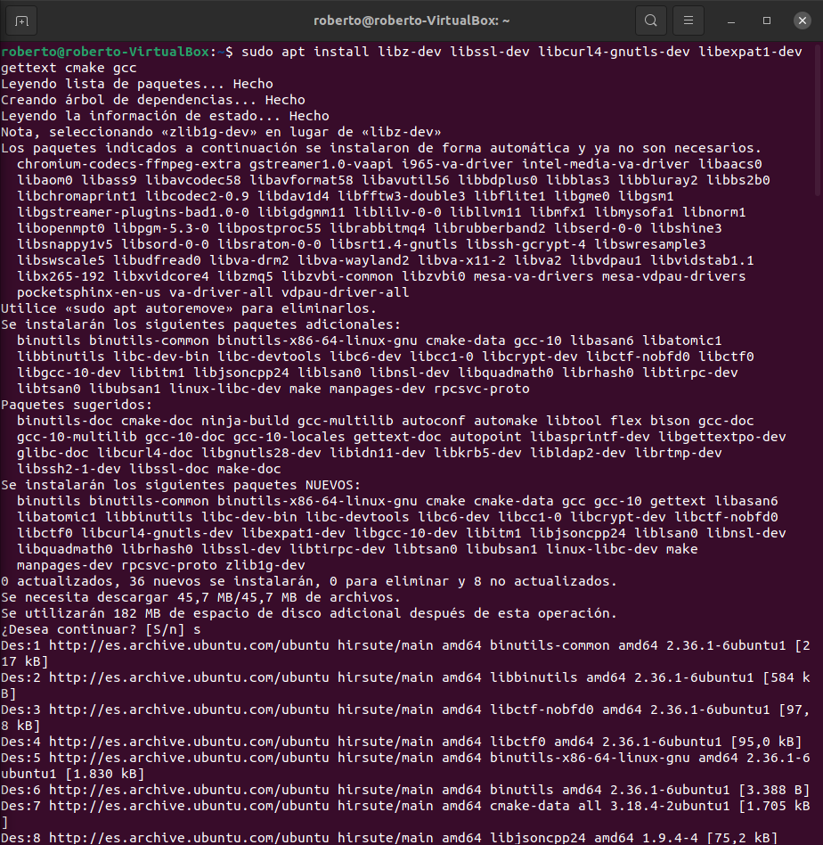
</div>  
<div align="center">
  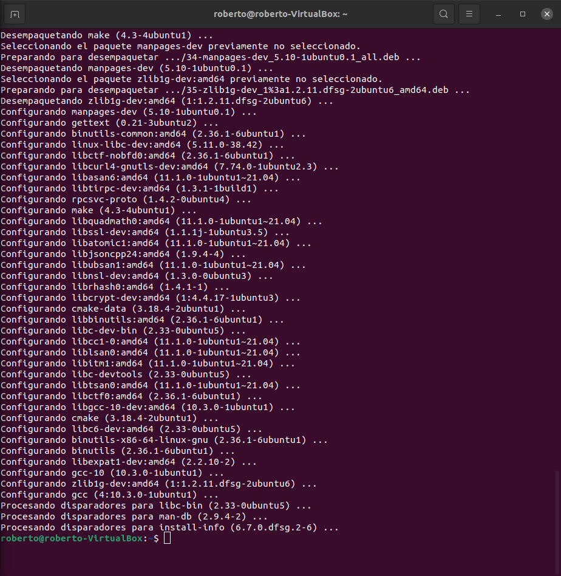
</div> 
  
 3.	Tras haber instalado las dependencias necesarias, creamos un directorio temporal y nos desplazamos a dicho directorio. Aquí es donde descargaremos nuestro tarball de Git.  

```
mkdir tmp
cd /tmp
```   

<div align="center">
  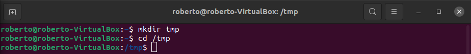
</div> 
  
 4.	Ahora descargados la versión especifica de Git que queramos instalar en nuestro caso trabajaremos con la versión 2.29.3 para descargarlo utilizaremos curl y enviaremos a la carpeta el archivo que descarguemos a git.tar.gz, para ello utilizamos el siguiente comando.  
  
```
curl -o git.tar.gz https://mirrors.edge.kernel.org/pub/software/scm/git/git-2.29.3.tar.gz
```   
  
<div align="center">
  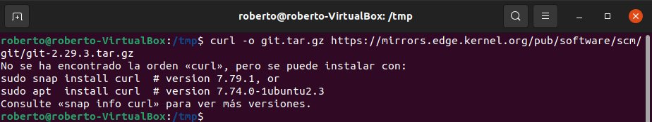
</div> 
  
 5.	Nos da un error porque no tenemos instalado el curl, asi que antes de seguir con la instalación procedemos a instalar curl, para ello usamos el siguiente comando.  
  
 ```
sudo snap install curl
```   
  
 6.	Una vez instalado Curl, volvemos a introducir el comando:  
  
<div align="center">
  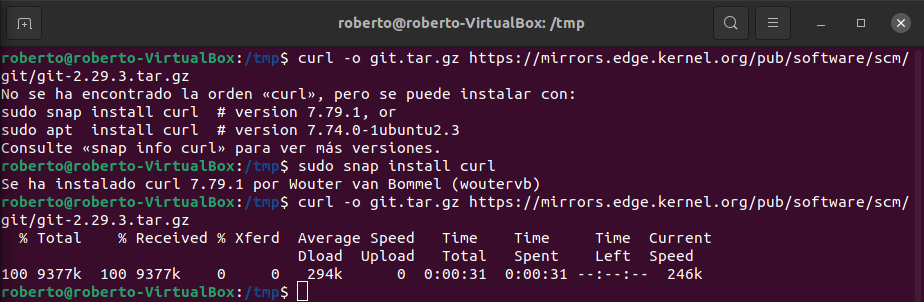
</div> 
  
7.	Ahora descomprimimos el archivo tarball, una vez terminados nos desplazamos a la carpeta del nuevo directorio de Git.  
  
<div align="center">
  
</div> 
  
 8.	Ahora podemos crear el paquete e instalarlo escribiendo estos dos comandos:  
  
```
make prefix=/usr/local all
sudo make prefix=/usr/local install
``` 
<div align="center">
  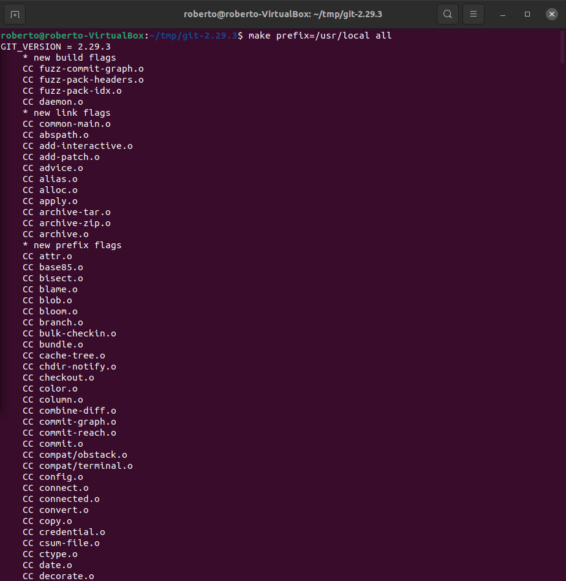
</div> 
<div align="center">
  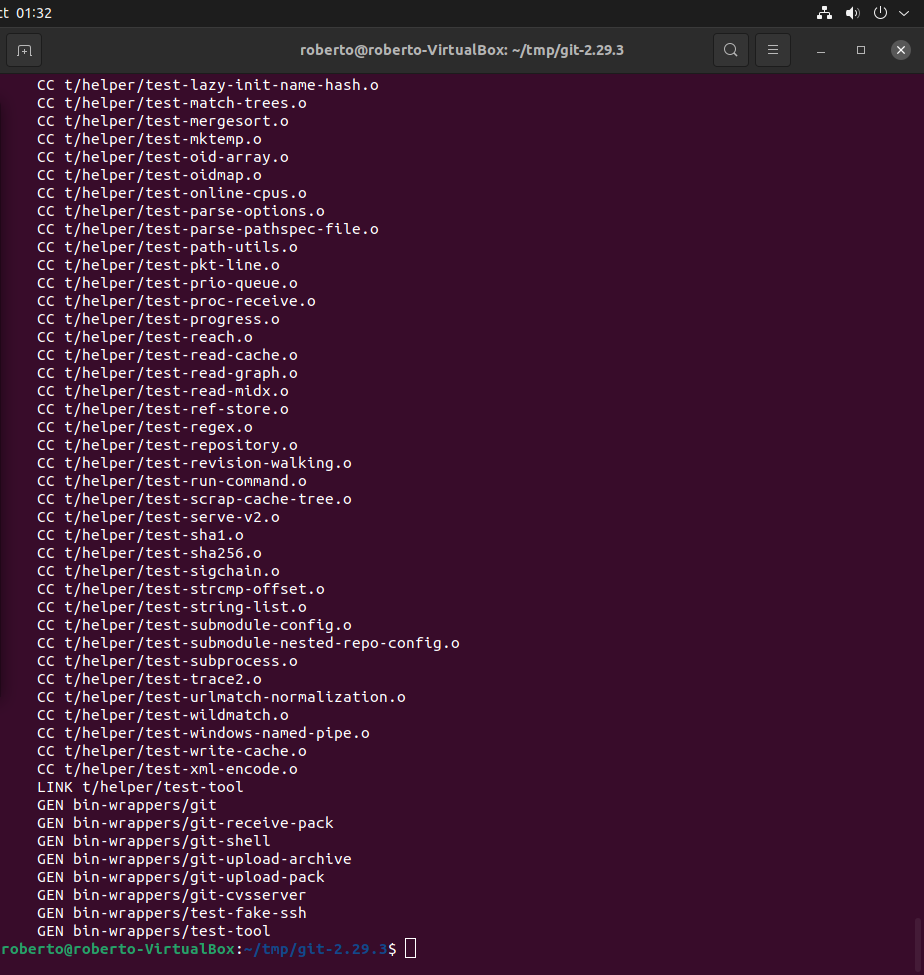
</div>    
<div align="center">
  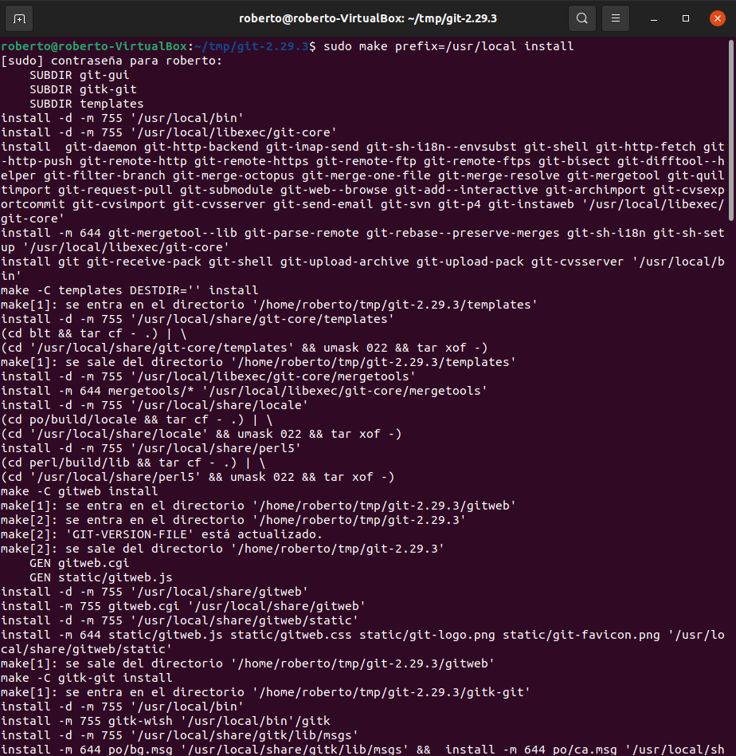
</div>    
<div align="center">
  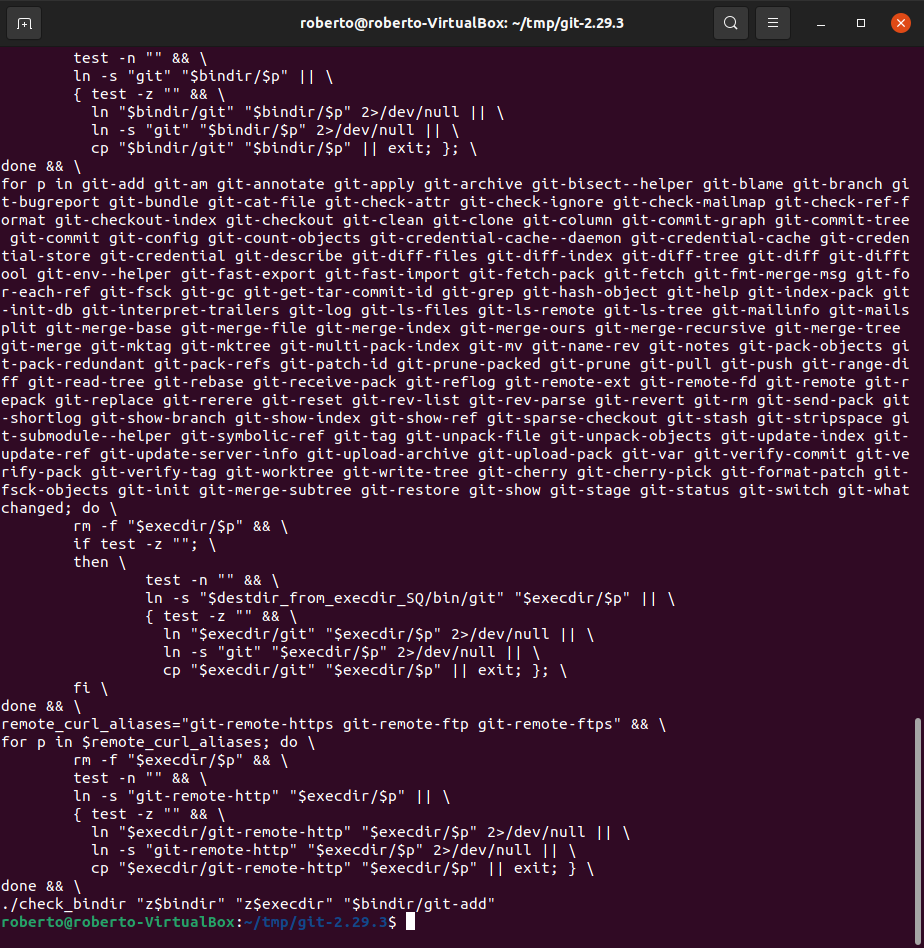
</div>    
  
 9.	Una vez terminado el proceso, modificamos el proceso de Shell para que se utilice la versión de Git que acabamos de instalar, para ello usamos el siguiente comando:
  
 ```
 exec bash
```
  
<div align="center">
  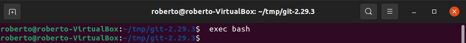
</div> 
  
 10.	Una vez completado esto volvemos a verificar la versión instalada para verificar que se ha realizado el proceso correctamente para ello usaremos el siguiente comando:  
  
```
git --version
```   
  
<div align="center">
  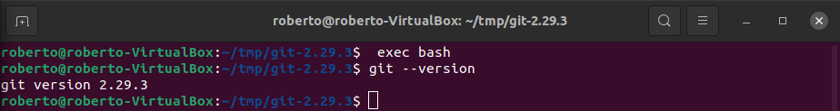
</div>  
  
## Configuración de Git;  
  
 1.	Procedemos a configurar el nombre de usuario y el correo electrónico. Para ello emplearemos los siguientes comandos:  
  
```
git config --global user.name "Your Name"
git config --global user.email "youremail@domain.com"
```
  
<div align="center">
  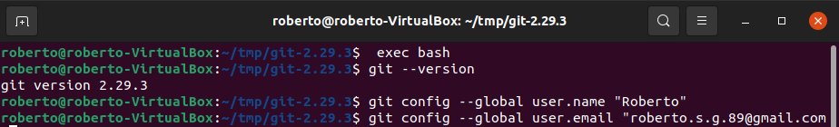
</div> 
  
 2.	Podemos ver todos los elementos de configuración creados escribiendo lo siguiente:  
  
```
git config --list
```  
  
<div align="center">
  
</div> 

 3.	También podemos editar esta información manualmente con un editor de texto para ello vamos a utilizar por ejemplo el nano y el siguiente comando:
  
```
nano ~/.gitconfig
```  
  
<div align="center">
  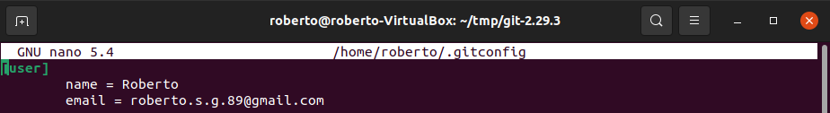
</div> 
</div>
